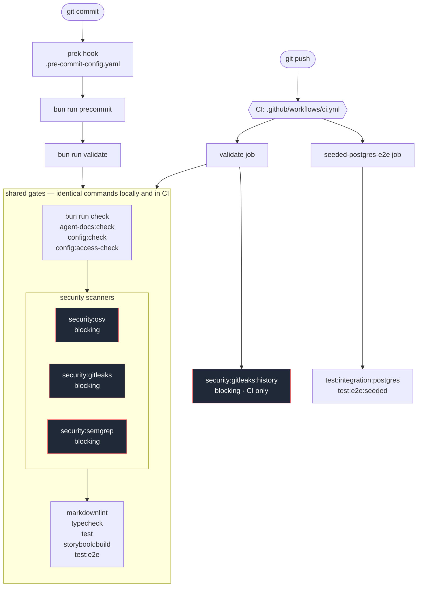

# MVP Security Review

## Purpose

This review is the final MVP gate. It checks that the portal is safe enough to operate with real repositories, real GitHub accounts, and live deployment metadata.

## Scope

1. Authentication and session handling.
2. GitHub token handling and least privilege.
3. Vercel data access and display.
4. Database access and tenant isolation.
5. Server-side authorization checks.
6. Logging, auditability, and error handling.
7. Agent actions that can affect external systems.
8. Structured logging redaction and correlation safety.

## Review Questions

1. Can a user see only repositories and data they are allowed to access?
2. Are tokens stored, refreshed, and scoped safely?
3. Are write actions behind explicit authorization and review gates?
4. Are secrets excluded from logs, previews, and UI output?
5. Can the system explain how a high-risk action was triggered?
6. Is there a clear rollback or containment path for bad automation?
7. Do Pino logs preserve useful correlation ids without leaking tokens, payload bodies, OAuth data, or private keys?

## Auth And Session Notes

1. Real portal sessions use Auth.js GitHub SSO with database-backed Drizzle
   sessions.
2. The GitHub `login` is persisted as `users.github_login` for human-readable
   approval and future run attribution. Authorization binds to the immutable
   provider account id projected from the Auth.js account row into the session;
   the session projection never includes the provider access token.
3. Username and organization allowlists fail closed when
   `LOOPWORKS_AUTH_BYPASS` is not active.
4. Active organization-allowlist sessions revalidate membership through the
   persisted GitHub OAuth token with a short successful-result cache and fail
   closed when token or org evidence is unavailable.
5. `LOOPWORKS_AUTH_BYPASS` is a local fixture path only and must remain disabled
   in production. It has no Auth.js provider account row, so callback identity
   matching is skipped only when the authenticated session explicitly reports
   fixture mode.
6. OAuth access tokens may exist in the Auth.js accounts table; logs and UI must
   never expose tokens, raw OAuth profiles, or authorization headers.
7. GitHub App installation callbacks use expiring actor-bound state and PKCE.
   The transient GitHub App user token verifies that `/user.id` matches the
   active session's immutable provider account id before installation discovery,
   access checks, App verification, or persistence, then is discarded without
   persistence or logging. Mutable login changes do not break that binding, and
   historical login reuse by a different account fails closed.
8. Callback state, authorization codes, PKCE verifiers, cookies, client secrets,
   private keys, tokens, provider account ids, and raw GitHub user or error
   objects are excluded from logs and OTel attributes. Structured logger
   sanitization applies recursively rather than assuming a fixed object depth.
9. Sign-in and sign-in failure are served from the app-owned `/sign-in` route
   (ADR 0028). The `error` query parameter is attacker-controlled — the proxy
   carries the original request's query string onto the redirect, and
   `/api/auth/error` forwards its parameter verbatim — so it is resolved through
   a closed code map with a generic fallback and is never shown as visible copy. Denial
   copy states the outcome and a human next step; it must never name the
   allowlist, an organization, a scope, a token, or an Auth.js error type.
10. `src/lib/auth/sign-in-action.ts` is a `"use server"` module, so its exports
    are public endpoints. It only starts the GitHub authorization handshake, and
    it re-sanitizes the submitted `callbackUrl` to a same-origin path rather than
    trusting the hidden field the page rendered.

## Issue Activation Authorization

1. A webhook signature authenticates GitHub delivery, not the actor's authority
   to start repository compute.
2. Verified ingress retains immutable sender ID/login, repository ID/full name,
   installation ID, and exact changed-label or milestone evidence in a bounded
   activation envelope. Issue title/body and raw payload remain outside it.
3. The applicable shipped manifest is the sole action allowlist. `opened`,
   `reopened`, `labeled`, and `milestoned` have exact not-ready to ready
   evaluators; `edited` remains non-executable. Declared actions without an
   evaluator fail as `manifest_drift`.
4. Repository ID/full name and installation ID must match one active tracked
   repository before the installation-authenticated permission read.
5. Triage or higher authorizes activation. Below-triage permission denies it;
   missing, malformed, rate-limited, unauthorized, unavailable, or
   identity-mismatched evidence is indeterminate and returns retryable 503.
6. No service actor bypass exists. A future exception requires an exact actor
   ID, repository ID, and installation ID tuple and a separately reviewed
   policy change.
7. Unauthorized, ignored, drift, and indeterminate content never reaches run
   construction. Delivery and issue guards still enforce at-most-one run.

## Required Checks

1. Session validation and CSRF protections.
2. Repo access verification on every sensitive request.
3. Secret redaction in logs and surfaced summaries.
4. Safe defaults for any external write operation.
5. Auditable records for approvals and automation actions.
6. Basic rate limiting or abuse controls where applicable.
7. Structured log samples for webhook rejection, duplicate delivery, approval rejection, and Vercel API fallback.
8. Username/org allowlist coverage for allowed and denied GitHub identities.
9. Forged, expired, cross-actor, concurrent, and replayed installation callback
   coverage, including zero durable installation writes on rejection.
10. Callback identity coverage for same-account login renames, different-account
    historical login reuse, missing session bindings, gateway id normalization,
    and rejection before discovery or durable writes.
11. Signed issue activation coverage for outsider open/reopen, unrelated or
    missing changed fields, exact final label/milestone transitions,
    repository/installation mismatch, permission API failure, duplicate and
    concurrent deliveries, and raw-content exclusion from durable audit and
    OTel.

## Approval Audit Notes

1. Approval transitions require an authenticated GitHub login or explicit local
   fixture actor from `requireApiSession`.
2. `approvals` stores current state; `approval_transition_events` stores the
   durable transition audit trail with actor, action, previous status, next
   status, timestamp, note, and auth mode metadata.
3. `bypassed` is a visible terminal state. A bypass must be created through the
   `bypass` transition from `requested` and must preserve actor attribution.

## Automated Security Scanning

Added by #175. The scanners are wired into the same chain as every other gate,
so a commit reaches them before it reaches a reviewer.

### The validation pipeline



Two properties hold the chain together, and both are enforced by tests rather
than by convention:

- Every command in `bun run validate` must appear verbatim as a `run:` step in
  the CI `validate` job, with no `continue-on-error` and no `if`
  (`tests/unit/ci/ci-workflow.test.ts`,
  `tests/unit/ci/security-scanning.test.ts`).
- The hook must keep reaching `validate` rather than restating its gates
  (`tests/unit/ci/validation-chain.test.ts`).

### The merge contract

A gate that fails a CI job only blocks a merge if the branch requires that job.
Until 2026-08-11 `main` had no branch protection and no required status checks,
so every gate described here as "blocking" blocked a job and nothing else: a
pull request could be merged with CI red, or with CI never having run. That gap
was #235.

`main` now carries two rulesets:

| Ruleset | Rules |
| --- | --- |
| [17921291](https://github.com/ncolesummers/loopworks/rules/17921291) | `deletion`, `non_fast_forward`, `copilot_code_review` |
| [20728131](https://github.com/ncolesummers/loopworks/rules/20728131) | `pull_request`, `required_status_checks` |

Changes must arrive through a pull request — direct pushes to `main` are
rejected — and these contexts must pass before it can merge:

| Context | Published by | Covers |
| --- | --- | --- |
| `validate` | `ci.yml` | The full gate chain, scanners included |
| `seeded-postgres-e2e` | `ci.yml` | Native Postgres admission and seeded journeys |
| `commit-provenance` | `commit-provenance.yml` | GitHub-resolved signed provenance (ADR 0026) |

Each is pinned to `integration_id` 15368, the GitHub Actions app, so a context
of the same name published by any other app does not satisfy the requirement.
`required_approving_review_count` is 0: the rule forces changes through a pull
request, it does not require a second reviewer. There are no bypass actors, so
an emergency direct push means disabling the ruleset deliberately rather than
slipping past it.

`commit-provenance` is a commit *status* rather than a check run, published by
the workflow's own `gh api` steps. `validate` had to be made unique before it
could be required at all: `ci.yml` and `commit-provenance.yml` both defined a
job of that name and both run on every pull request, so two check runs shared
one context and the rule could not express which had to pass.
`tests/unit/ci/ci-workflow.test.ts` now fails if any two pull-request jobs
collide on a check-run name.

Two ADR 0026 follow-ups remain unconfigured and need explicit authorization,
because both change what a contributor can push: `required_signatures` on the
default branch, and disabling rebase-and-merge. Until the second lands, ruleset
20728131 still allows all three merge methods, which ADR 0026 does not want.

### Scanner inventory

| Scanner | Version | Command | Covers | Enforcement |
| --- | --- | --- | --- | --- |
| OSV-Scanner | 2.5.0 | `bun run security:osv` | Dependency vulnerabilities | Blocking |
| Gitleaks | 8.30.1 | `bun run security:gitleaks` | Secrets in the working tree | Blocking |
| Gitleaks | 8.30.1 | `bun run security:gitleaks:history` | Secrets in committed history | Blocking, CI only |
| Semgrep | 1.172.0 | `bun run security:semgrep` | Curated LoopWorks rules | Blocking |

`bun run security:scan` runs the three validate-lane scanners together.

Versions are pinned exactly in `scripts/run-security-scanner.ts` and the runner
refuses to run against any other version — a mismatched binary is a present
analyzer applying rules nobody reviewed, so it fails rather than skips.

### Dependabot update intake

Dependabot vulnerability alerts and automated security-fix pull requests are
enabled for the public repository. `.github/dependabot.yml` also requests
weekly version updates for the Bun lockfile and GitHub Actions. GitHub's Bun
integration supports the text `bun.lock` for version updates but not security
updates, so the blocking OSV gate remains the dependency-vulnerability source
of truth.

Routine production and development minor/patch updates are grouped separately.
Eve, Next.js, Auth.js, OpenTelemetry, and the Vercel OTel integration are
excluded from the production group so their migrations arrive as isolated pull
requests with focused evidence. Every Dependabot pull request still traverses
the same blocking CI and scanner chain shown above.

Package security updates can still arrive through an ecosystem that updates
`package.json` without understanding Bun's text lockfile. Lockfile repair is
split across two workflows so that limitation does not weaken the PR trust
boundary:

1. `dependabot-bun-lock.yml` runs on package-manifest PRs with `contents: read`,
   requires the actor, PR author, and same-repository head to identify
   Dependabot, and runs `bun install --ignore-scripts`. It uploads only the
   generated `bun.lock` and immutable head metadata.
2. `dependabot-bun-lock-commit.yml` runs from the trusted default branch after a
   successful generator run. Its single fixed shell step grants only
   `actions: write` and `contents: write`, validates the run/artifact/head
   binding, never executes PR code, commits only a changed `bun.lock` using an
   exact-head lease, and explicitly dispatches CI for the repaired head.

This split is required because GitHub forces Dependabot-authored
`pull_request` and `pull_request_target` runs to a read-only token regardless of
a workflow's requested write scope. The generated lock remains untrusted data:
the privileged stage verifies the repository's `image-size@2.0.2` patch entry
before committing it, and the ordinary frozen-lockfile CI jobs validate the
result from scratch. The explicit dispatch is necessary because GitHub does not
emit ordinary workflow events for a push authenticated by the repository
`GITHUB_TOKEN`.

Third-party actions are pinned to immutable full commit SHAs in every workflow,
with their reviewed release versions retained as trailing comments. Dependabot's
GitHub Actions ecosystem proposes SHA updates, and a repository contract rejects
mutable tags or abbreviated refs. Integrity among installed scanner tools still
differs, and the difference is worth knowing:

- Gitleaks and OSV-Scanner are downloaded and checked against a SHA-256 digest
  pinned **in `ci.yml` itself**, not against the publisher's manifest — fetching
  that manifest from the same origin as the binary only proves the transfer was
  not corrupted. The binaries are deliberately **not cached**: a cache keyed on
  version alone, with a "skip the download if present" guard, would let anyone
  who can run a workflow seed it with a stub that prints the pinned version, and
  the version check would then certify the stub.
- Semgrep is a Python tool with no single release artifact to digest-pin, so the
  `==` pin is trust-on-first-use against PyPI and its transitive tree is
  unpinned. That is weaker, and it is the price of having a SAST lane at all.

Install locally:

```bash
brew install gitleaks osv-scanner
uv tool install semgrep==1.172.0
```

### Enforcement policy

| Condition | Local | CI |
| --- | --- | --- |
| Binary missing | Skipped, with the install command printed | Fails |
| Version differs from the pin | Fails | Fails |
| Scanner crashed, timed out, or returned a partial result | Fails | Fails |
| Findings, blocking scanner | Fails | Fails |
| Findings, advisory scanner | Recorded | Recorded |

Set `LOOPWORKS_SECURITY_REQUIRE_SCANNERS=true` to make a local run behave
exactly like CI.

Advisory remains a supported property of a *finding*, decided in
`scripts/run-security-scanner.ts` and covered by unit tests. It is deliberately
not `continue-on-error` in the workflow, which would also swallow a scanner
crash, a timeout, and a missing binary — the failure mode this work exists to
prevent. No configured scanner is advisory today, no CI step in this repository
carries `continue-on-error`, and tests assert both facts. The two lanes that
will use the advisory disposition are deferred and tracked, not abandoned; see
[Deferred](#deferred).

### Documented local/CI divergences

1. **A missing scanner binary is skipped locally and fails in CI.** A developer
   who has not installed the scanners still gets a working `bun run validate`,
   and the skip prints the install command so it can never be mistaken for a
   pass. CI installs all three at their pinned versions, so it never skips.
2. **Committed-history secret scanning is CI only.** The local gate scans the
   working tree, which is what a developer can still change before pushing.
   Reproduce a CI history failure locally with the identical command,
   `bun run security:gitleaks:history`. This split is about division of labour,
   not runtime: re-measured on 2026-08-11 at 258 commits the history scan takes
   about 1.5s, so it can be promoted into `validate` by changing `lane` in the
   registry alone. Whether it should be is tracked as
   [#233](https://github.com/ncolesummers/loopworks/issues/233); note that
   #175's own exception criterion asks for a divergence "justified by runtime or
   environment constraints", which this one explicitly is not.

### Baseline and suppression policy

- Suppressions are exact — an advisory ID, or a commit/path/rule fingerprint —
  never a widened pattern.
- Each carries a written justification, a durable tracking issue, and an expiry
  where the scanner supports one. `tests/unit/ci/security-scanning.test.ts`
  parses OSV exception blocks structurally and fails on duplicate, broad,
  permanent, undocumented, or package-wide exceptions. It separately checks
  Gitleaks array elements, where appending one catch-all pattern would disable
  the scanner.
- Baselines are never regenerated or widened in CI.
- Findings are fixed, or converted into separately prioritized, evidence-backed
  issues. No verified Critical or High finding is silently baselined.

Current suppressions:

- `.gitleaksignore` — one fingerprint: a synthetic AWS key committed as *input*
  to the agent output-redaction test, which asserts the redactor strips it.
- `.gitleaks.toml` — the generated `exampleValue` placeholders from the config
  registry, which `readConfigValue` already rejects at runtime in production;
  and path exclusions for build output. Note that Gitleaks applies path
  exclusions in `git` mode as well as `dir` mode, so an exclusion hides a path
  from the history gate too. Every entry is checked against `git ls-files` by
  `tests/unit/ci/security-scanning.test.ts`, which fails if one starts covering
  tracked files — `bun.lock` and all of `.claude/` were both exactly that
  before review caught it.
- `.semgrepignore` — replaces Semgrep's bundled default, which excluded
  `tests/` and silently took 119 files out of scope.
- `osv-scanner.toml` — three residual exceptions reviewed on 2026-08-12:

| Advisory | Severity | Package / dependency path | Reachability / justification | Tracking | Expires |
| --- | --- | --- | --- | --- | --- |
| `GHSA-67mh-4wv8-2f99` | Moderate | `esbuild@0.18.20` through development-only `drizzle-kit` → `@esbuild-kit/esm-loader` | Application and production build paths use patched esbuild versions; remove this exception when Drizzle Kit drops the legacy loader. | [#180](https://github.com/ncolesummers/loopworks/issues/180) | 2026-11-06 |
| `GHSA-5p2g-fcmc-qvqq` | High, locally fixed | `image-size@2.0.2` through `@storybook/nextjs-vite` | No upstream patched release exists. `patches/image-size@2.0.2.patch` rejects undersized JXL and HEIF boxes, and child-process regression tests prove crafted inputs terminate. The OSV entry filters version-only metadata after the vulnerable behavior is fixed. | [#180](https://github.com/ncolesummers/loopworks/issues/180) | 2026-11-06 |
| `GHSA-w3rx-r6r6-pgpr` | High, locally fixed | `image-size@2.0.2` through `@storybook/nextjs-vite` | No upstream patched release exists. `patches/image-size@2.0.2.patch` rejects undersized ICNS entries, and a child-process regression test proves crafted input terminates. The OSV entry filters version-only metadata after the vulnerable behavior is fixed. | [#180](https://github.com/ncolesummers/loopworks/issues/180) | 2026-11-06 |

`GHSA-8988-4f7v-96qf` was removed on 2026-08-12 after the coordinated
`@vercel/otel` 2.1.3, OpenTelemetry stable 2.10.0, and experimental/exporter
0.221.0 migration removed `@opentelemetry/core` 1.x from the lock graph.
Adversarial testing found that Vercel's distribution still bundled the
vulnerable baggage implementation even though OSV reported the visible graph as
fixed. The exact-version `patches/@vercel%2Fotel@2.1.3.patch` replaces both
published runtime call sites with the fixed core 2.10 propagator. Node and Edge
subprocess tests enforce the 180-entry and per-entry limits while proving
Vercel runtime trace-context extraction remains active.

The two High advisories are fixed in the installed package with a Bun-managed
repository patch because upstream has not published a release. Their OSV
entries do not accept vulnerable behavior: OSV keys only on the unchanged
upstream version and cannot observe the patch. Tests execute each published
zero-length-box failure mode in a timeout-bounded child process, so either an
absent patch or a regression fails without hanging the validation runner.

### OSV remediation evidence

The fresh 2026-08-08 baseline with OSV-Scanner 2.5.0 was 98 vulnerabilities
across 32 packages: 5 Critical, 45 High, 40 Moderate, 6 Low, and 2 Unknown.
Targeted parent upgrades, the Storybook Vite migration, removal of the unused
repository-local Vercel CLI, same-major overrides, and the reviewed
`image-size` patch and OpenTelemetry 2 migration reduced that to one unresolved
Moderate exception plus two locally fixed High advisories that OSV still
matches by version. With those exact entries applied, the blocking scan reports
zero unhandled findings.

### Triage

1. Reproduce with the repository-owned command; do not hand-run the binary with
   different flags.
2. Fix the finding if it is real.
3. If it is a true negative, suppress it at the narrowest scope available — an
   inline `gitleaks:allow`, a fingerprint, an advisory ID — with a comment
   saying why.
4. If it is real but cannot be fixed now, open an issue with the evidence and
   reference it from the suppression. Verified production-reachable Critical
   and High findings are never suppressed; update, override, remove, or patch
   the dependency before OSV can pass. When a repository patch fixes an
   unpatched upstream High, its version-only OSV entry must reference the patch
   and timeout-bounded regression coverage.

### Ownership and cadence

Pinned versions are reviewed monthly and on any advisory affecting a scanner
itself. A version bump changes `scripts/run-security-scanner.ts`, the CI install
step, and the cache key together; the contract tests fail if they drift apart.

Semgrep rules are verified against a positive and a negative fixture before
being added. Keep the fixtures outside the repository — code written to trip
these rules would fail the gate it is meant to prove — and record the run in the
pull request.

### Deferred

Two advisory lanes were deliberately left out of #175. Each is tracked as its
own issue and stays deferred until its false-positive and runtime baseline has
been reviewed against this repository. Every entry below must be a list item
linking the issue that carries it, and `tests/unit/ci/security-scanning.test.ts`
(`deferred lanes`) fails on one that is not — before that check this section was
a prose paragraph naming only the issue the work was deferred *from*, which once
that issue closed would have left the work indistinguishable from abandoned. The
check cannot prove a linked issue is still open. The lanes:

- Broad upstream/community Semgrep rules —
  [#231](https://github.com/ncolesummers/loopworks/issues/231). The wiring is a
  registry entry; the cost is triaging the finding volume an unreviewed upstream
  ruleset produces here.
- ZAP against a local production-mode deployment —
  [#232](https://github.com/ncolesummers/loopworks/issues/232). Needs a
  production build, a seeded database, a digest-pinned container, and a
  documented authenticated route scope. Sequenced after
  [#200](https://github.com/ncolesummers/loopworks/issues/200) and
  [#201](https://github.com/ncolesummers/loopworks/issues/201) so the baseline
  is not measured against a route surface that is about to change.

## Exit Criteria

1. No open high-severity findings.
2. Token and session handling are documented.
3. External write paths are explicitly gated.
4. Audit records exist for key agent and operator actions.
5. The MVP can be used without exposing secrets or cross-tenant data.
