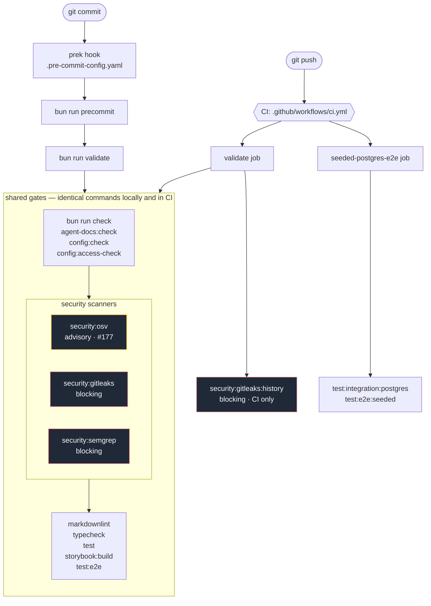

# MVP Security Review

## Purpose

This review is the final MVP gate. It checks that the portal is safe enough to operate with real repositories, real GitHub accounts, and live deployment metadata.

## Scope

1. Authentication and session handling.
2. GitHub token handling and least privilege.
3. Vercel data access and display.
4. Database access and tenant isolation.
5. Server-side authorization checks.
6. Logging, auditability, and error handling.
7. Agent actions that can affect external systems.
8. Structured logging redaction and correlation safety.

## Review Questions

1. Can a user see only repositories and data they are allowed to access?
2. Are tokens stored, refreshed, and scoped safely?
3. Are write actions behind explicit authorization and review gates?
4. Are secrets excluded from logs, previews, and UI output?
5. Can the system explain how a high-risk action was triggered?
6. Is there a clear rollback or containment path for bad automation?
7. Do Pino logs preserve useful correlation ids without leaking tokens, payload bodies, OAuth data, or private keys?

## Auth And Session Notes

1. Real portal sessions use Auth.js GitHub SSO with database-backed Drizzle
   sessions.
2. The GitHub `login` is persisted as `users.github_login` and is the operator
   identity used for approval and future run attribution.
3. Username and organization allowlists fail closed when
   `LOOPWORKS_AUTH_BYPASS` is not active.
4. Active organization-allowlist sessions revalidate membership through the
   persisted GitHub OAuth token with a short successful-result cache and fail
   closed when token or org evidence is unavailable.
5. `LOOPWORKS_AUTH_BYPASS` is a local fixture path only and must remain disabled
   in production.
6. OAuth access tokens may exist in the Auth.js accounts table; logs and UI must
   never expose tokens, raw OAuth profiles, or authorization headers.
7. GitHub App installation callbacks use expiring actor-bound state and PKCE.
   The transient GitHub App user token verifies the active operator and
   installation association, then is discarded without persistence or logging.
8. Callback state, authorization codes, PKCE verifiers, cookies, client secrets,
   private keys, tokens, and raw GitHub error objects are excluded from logs.

## Required Checks

1. Session validation and CSRF protections.
2. Repo access verification on every sensitive request.
3. Secret redaction in logs and surfaced summaries.
4. Safe defaults for any external write operation.
5. Auditable records for approvals and automation actions.
6. Basic rate limiting or abuse controls where applicable.
7. Structured log samples for webhook rejection, duplicate delivery, approval rejection, and Vercel API fallback.
8. Username/org allowlist coverage for allowed and denied GitHub identities.
9. Forged, expired, cross-actor, concurrent, and replayed installation callback
   coverage, including zero durable installation writes on rejection.

## Approval Audit Notes

1. Approval transitions require an authenticated GitHub login or explicit local
   fixture actor from `requireApiSession`.
2. `approvals` stores current state; `approval_transition_events` stores the
   durable transition audit trail with actor, action, previous status, next
   status, timestamp, note, and auth mode metadata.
3. `bypassed` is a visible terminal state. A bypass must be created through the
   `bypass` transition from `requested` and must preserve actor attribution.

## Automated Security Scanning

Added by #175. The scanners are wired into the same chain as every other gate,
so a commit reaches them before it reaches a reviewer.

### The validation pipeline



Two properties hold the chain together, and both are enforced by tests rather
than by convention:

- Every command in `bun run validate` must appear verbatim as a `run:` step in
  the CI `validate` job, with no `continue-on-error` and no `if`
  (`tests/unit/ci/ci-workflow.test.ts`,
  `tests/unit/ci/security-scanning.test.ts`).
- The hook must keep reaching `validate` rather than restating its gates
  (`tests/unit/ci/validation-chain.test.ts`).

### Scanner inventory

| Scanner | Version | Command | Covers | Enforcement |
| --- | --- | --- | --- | --- |
| OSV-Scanner | 2.5.0 | `bun run security:osv` | Dependency vulnerabilities | Advisory until #177 |
| Gitleaks | 8.30.1 | `bun run security:gitleaks` | Secrets in the working tree | Blocking |
| Gitleaks | 8.30.1 | `bun run security:gitleaks:history` | Secrets in committed history | Blocking, CI only |
| Semgrep | 1.172.0 | `bun run security:semgrep` | Curated LoopWorks rules | Blocking |

`bun run security:scan` runs the three validate-lane scanners together.

Versions are pinned exactly in `scripts/run-security-scanner.ts` and the runner
refuses to run against any other version — a mismatched binary is a present
analyzer applying rules nobody reviewed, so it fails rather than skips.

Install locally:

```bash
brew install gitleaks osv-scanner
uv tool install semgrep==1.172.0
```

### Enforcement policy

| Condition | Local | CI |
| --- | --- | --- |
| Binary missing | Skipped, with the install command printed | Fails |
| Version differs from the pin | Fails | Fails |
| Scanner crashed, timed out, or returned a partial result | Fails | Fails |
| Findings, blocking scanner | Fails | Fails |
| Findings, advisory scanner | Recorded | Recorded |

Set `LOOPWORKS_SECURITY_REQUIRE_SCANNERS=true` to make a local run behave
exactly like CI.

Advisory is a property of the *finding*, decided in
`scripts/run-security-scanner.ts` and covered by unit tests. It is deliberately
not `continue-on-error` in the workflow, which would also swallow a scanner
crash, a timeout, and a missing binary — the failure mode this work exists to
prevent. No CI step in this repository carries `continue-on-error`, and a test
asserts it across the whole workflow file.

### Documented local/CI divergences

1. **A missing scanner binary is skipped locally and fails in CI.** A developer
   who has not installed the scanners still gets a working `bun run validate`,
   and the skip prints the install command so it can never be mistaken for a
   pass. CI installs all three at their pinned versions, so it never skips.
2. **Committed-history secret scanning is CI only.** The local gate scans the
   working tree, which is what a developer can still change before pushing.
   Reproduce a CI history failure locally with the identical command,
   `bun run security:gitleaks:history`. This split is about division of labour,
   not runtime: measured at 205 commits the history scan takes about 0.8s, so it
   can be promoted into `validate` by changing `lane` in the registry alone.

### Baseline and suppression policy

- Suppressions are exact — an advisory ID, or a commit/path/rule fingerprint —
  never a widened pattern.
- Each carries a written justification, and an expiry where the scanner supports
  one. `tests/unit/ci/security-scanning.test.ts` fails on a broad or unexplained
  entry in either TOML baseline.
- Baselines are never regenerated or widened in CI.
- Findings are fixed, or converted into separately prioritized, evidence-backed
  issues. No verified Critical or High finding is silently baselined.

Current suppressions:

- `.gitleaksignore` — one fingerprint: a synthetic AWS key committed as *input*
  to the agent output-redaction test, which asserts the redactor strips it.
- `.gitleaks.toml` — the generated `exampleValue` placeholders from the config
  registry, which `readConfigValue` already rejects at runtime in production;
  and path exclusions for gitignored build output, which is scope rather than
  suppression.
- `osv-scanner.toml` — none. The dependency backlog is tracked in #177 rather
  than baselined.

### Triage

1. Reproduce with the repository-owned command; do not hand-run the binary with
   different flags.
2. Fix the finding if it is real.
3. If it is a true negative, suppress it at the narrowest scope available — an
   inline `gitleaks:allow`, a fingerprint, an advisory ID — with a comment
   saying why.
4. If it is real but cannot be fixed now, open an issue with the evidence and
   reference it from the suppression. Critical and High findings do not get a
   suppression without an issue.

### Ownership and cadence

Pinned versions are reviewed monthly and on any advisory affecting a scanner
itself. A version bump changes `scripts/run-security-scanner.ts`, the CI install
step, and the cache key together; the contract tests fail if they drift apart.

Semgrep rules are verified against a positive and a negative fixture before
being added. Keep the fixtures outside the repository — code written to trip
these rules would fail the gate it is meant to prove — and record the run in the
pull request.

### Deferred

Broad upstream/community Semgrep rules and ZAP against a local production-mode
deployment are a separate, advisory lane, deferred from #175 until their
false-positive and runtime baselines have been reviewed.

## Exit Criteria

1. No open high-severity findings.
2. Token and session handling are documented.
3. External write paths are explicitly gated.
4. Audit records exist for key agent and operator actions.
5. The MVP can be used without exposing secrets or cross-tenant data.
